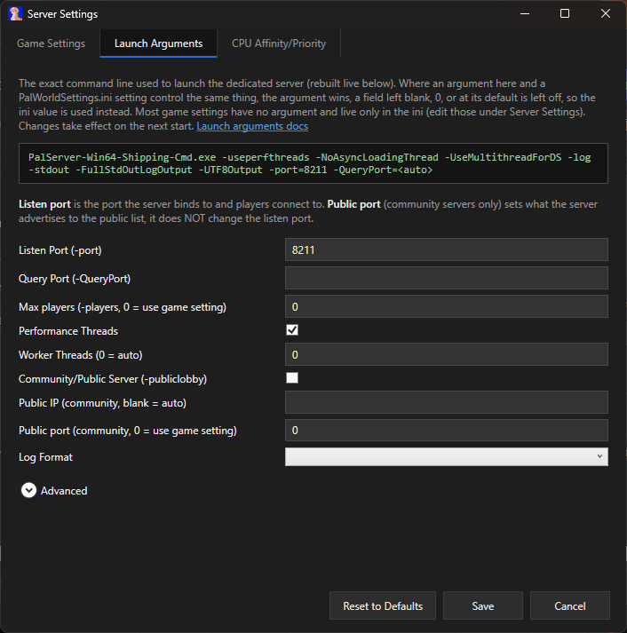
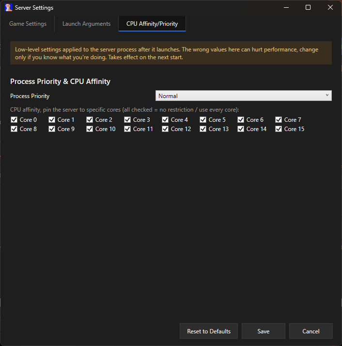
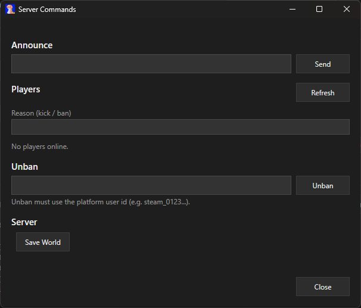
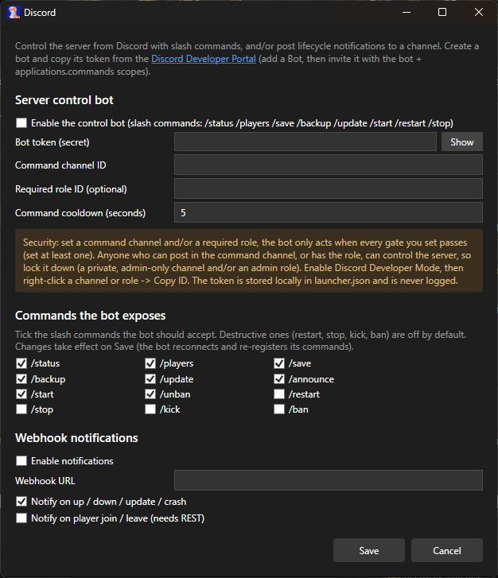
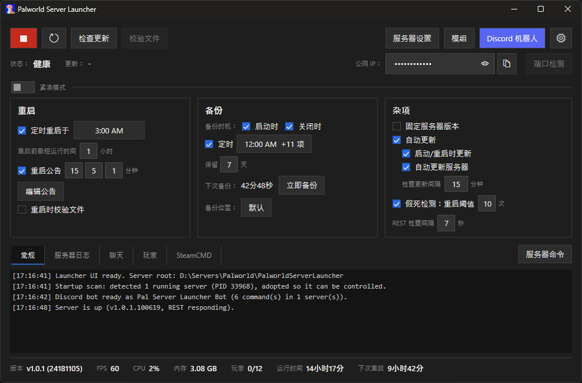

# Palworld Server Launcher

  

A Windows app for running a **Palworld dedicated server**: installs it, keeps it updated, handles scheduled
restarts and backups, and watches its health, all through Palworld's REST API. Native C# / WPF, single `.exe`.
Inspired by [Conan Exiles' Dedicated Server Launcher](https://forums.funcom.com/t/introducing-the-conan-exiles-dedicated-server-app/21699).

**[Download the latest release](https://github.com/SSyl/PalworldServerLauncher/releases/latest)** to get started.

Other languages are available: German, Spanish, French, Brazilian Portuguese, Russian, Japanese, Simplified
Chinese, Traditional Chinese, and Korean. See [Languages](#languages).

---

## Contents

- [Features](#features)
- [Getting started](#getting-started)
- [FAQ and troubleshooting](#faq-and-troubleshooting)
- [Advanced usage](#advanced-usage)
- [Privacy and security](#privacy-and-security)

---

## Features

### Install and update
- Installs SteamCMD and the server for you. **Start** checks for an update first (can be turned off).
- **Auto-updates when a new build drops**, restarting gracefully to apply it. Version-agnostic, so it keeps
  working across game updates without needing to be told about them.
- **Pin the server to its current build** to hold it there and pause updates, handy if a game update breaks
  something until you're ready for it.
- **Check for Update** (safe while running) and **Validate Files** buttons.
- **Import an existing server** you installed elsewhere: it's copied into the launcher so it can manage it,
  and your original is left where it was. Import only shows when the launcher doesn't already have a server; to
  bring in a different one, delete the current install at `PalworldServerLauncher\palworlddedicatedserver` first.

### Restarts and recovery
- **Scheduled restarts** at the times you set, with a minimum-uptime guard so a server that just came up
  won't get bounced.
- **In-game warnings** before a restart, at whatever marks you choose, skipped when nobody's online.
- **Crash and zombie recovery.** Restarts automatically on a crash, and also catches a server that's
  technically running but wedged (REST stopped answering, or the world stopped advancing). A safety cutoff
  stops it from looping forever if the server keeps dying.

### Backups
- Zips the world save and config, timestamped. Runs on startup, shutdown, a schedule, or on demand.
- Triggers a fresh in-game save first when the REST API is on, so the backup is actually current. Old
  automatic backups age out after a set number of days, manual ones are left alone.
- Save backups to a folder of your choice, or keep the default next to the launcher.

### Keeping an eye on things
- Live tiles for FPS, players, uptime, memory, version, and when the next restart and backup are due.
- Player joins and leaves show up in the log as they happen.
- **Port Check**: tests whether your game port is reachable from outside your network, and warns if your
  REST or RCON ports are exposed to the internet. Asks first, since it sends your public IP to an external
  checking service to run the test.

### Settings
- A full **Server Settings** editor for `PalWorldSettings.ini`, tabbed (World Settings / Admin /
  Undocumented), labeled with the game's own wording where it has one. **Search** filters the settings as you
  type, matching a setting's name, label, or description. Only writes what you changed, and shows a preview
  before saving.
- **Difficulty presets**: Casual, Normal, Hard, or Hardcore in one click, previewed first.
- A **Launch Arguments** editor with a live preview of the exact command line.
- **Advanced**: set the server's process priority and pin it to specific CPU cores, re-applied automatically
  since Unreal resets affinity on launch.

### Background and logs
- Runs the server quietly in the background, no console window. Survives the launcher closing or crashing,
  and offers to pick the server back up next time you open it, or does it automatically if you turn that on.
- **Start at login** (optional): opens the launcher and starts the server when you sign into Windows, so
  restarts, backups, and recovery keep running without you.
- Logs from the launcher, SteamCMD, and the server show up in-app and to a rotating log file (last ten kept).
  `--debug` and `--console` give more detail, see [Command-line options](docs/advanced-usage.md#command-line-options).

### Discord (optional)
- **Webhook** notifications when the server comes up, goes down, updates, crashes, or players come and go.
- A **control bot**: `/status`, `/players`, `/save`, `/backup`, `/update`, `/start`, `/restart`, `/stop` from
  a locked-down channel and/or role. Restart and stop confirm first. Setup guide:
  [docs/discord-bot-setup.md](docs/discord-bot-setup.md).

### Languages
- Available in **English**, **German** (Deutsch), **Spanish** (Español), **French** (Français),
  **Brazilian Portuguese** (Português (Brasil)), **Russian** (Русский), **Japanese** (日本語),
  **Simplified Chinese** (简体中文), **Traditional Chinese** (繁體中文), and **Korean** (한국어). Pick your
  language on first run, or any time from Launcher Settings (the gear icon in the top-right), then it restarts
  to apply.
- Every language except English is machine-translated (the in-game setting names come from Palworld's own
  translations), so if something reads oddly, corrections via an issue or pull request are welcome.

---

## Screenshots

**The settings editor.** One tabbed window for every `PalWorldSettings.ini` value, labeled with the game's own wording.

**Difficulty presets.** Apply a Casual / Normal / Hard / Hardcore set of values, with a preview of exactly what changes.

**Launch arguments**, with a live preview of the exact command line.

**CPU affinity and priority.** Set the server process priority and pin it to specific CPU cores.

**Picking restart and backup times.**

**Customizable in-game restart announcements.**

**Live server commands.** Announce a message, kick, ban, or unban a player, and save the world, all while the server is running.

**Discord.** Optional webhook notifications and a locked-down control bot, with a checklist of exactly which slash commands it may run.

**Available in several languages.** English, German, Spanish, French, Brazilian Portuguese, Russian, Japanese,
Simplified Chinese (shown here), Traditional Chinese, and Korean.

---

## Getting started

You'll need **Windows 10 or 11 (64-bit)**, plus room and bandwidth for the server install (a full install with
no mods sits a bit under 6 GB as of Palworld 1.0). The launcher itself is light (around 100 MB of RAM), but the
Palworld dedicated server it runs is RAM-hungry, so check Palworld's
[official requirements](https://docs.palworldgame.com/getting-started/requirements/) before hosting.

**Download** the latest `PalworldServerLauncher.exe` from the
[releases page](https://github.com/SSyl/PalworldServerLauncher/releases/latest). It's a single file with no
installer, so drop it wherever you'd like the server to live.

> [!NOTE]
> The first time you run it, Windows may show a blue "Windows protected your PC" box, because the app isn't
> code-signed. Click **More info**, then **Run anyway**. Some antivirus tools may flag it for the same reason
> (an unsigned, self-contained build). If that worries you, the full source is here and you can
> [build it yourself](#building-from-source).

1. Run `PalworldServerLauncher.exe`.
2. Click **Install** to grab SteamCMD and the server. You only need this the first time.
3. Click **Start**. The very first launch creates the server's config files.

> [!TIP]
> Windows Firewall may ask whether to allow the Palworld server through. Click **Allow access**, otherwise
> the server won't be reachable over the network and players won't be able to connect.

4. When offered, turn on the **REST API** (it can generate a secure admin password for you). It's what powers
   the stats, graceful restarts, backups, and health checks. Without it the server still runs, but the
   launcher has to hard-stop it instead of shutting it down cleanly.
5. Optional: turn on **Scheduled restart** and pick your times, set up **Backups**, and connect **Discord**.

## FAQ and troubleshooting

Common hosting questions, how you and your friends connect, why a connection fails (firewall, port
forwarding, CGNAT), how to get listed in the community server browser, updating and pinning versions,
importing an existing server, and where your files live, are all answered in
**[docs/FAQ.md](docs/FAQ.md)**.

## Advanced usage

Running more than one server on the same machine, and the launcher's command-line options (`--console`,
`--start-server`, `--install-server`, and more), are covered in
**[docs/advanced-usage.md](docs/advanced-usage.md)**.

## Upcoming features

- A system-tray icon.
- A fuller headless / command-line mode. There's already `--install-server` and `--start-server` (see
  [Command-line options](docs/advanced-usage.md#command-line-options)), and you can run the launcher hidden
  with a small PowerShell script if you want it out of the way.

## Building from source

Most people don't need this, just grab a pre-built `.exe` from the
[releases page](https://github.com/SSyl/PalworldServerLauncher/releases/latest). If you'd rather build it
yourself (you'll need the **.NET 10 SDK**), see **[docs/building.md](docs/building.md)**.

## Privacy and security

> [!WARNING]
> Palworld's REST API and RCON aren't built to face the internet. Keep those ports (8212 and 25575) on your
> local network or behind a firewall, and only forward the game ports your players actually need.

The launcher runs on your machine and does not collect, transmit, or phone home any of your data. There is no
telemetry and no analytics. It makes network connections only to:

- your own server, over `127.0.0.1` (your local machine),
- Steam, to download SteamCMD and to install or update the server,
- your own Discord webhook and bot, if you choose to set them up,
- the **Port Check** feature, only if you use it, and only after it warns you first: it sends your public IP
  and the ports you're testing to check-host.cc, a free external probe service, and uses a separate lookup
  service to show your Public IP field.

Your settings, logs, backups, and any tokens stay on your PC in the launcher's folder, and your Discord bot
token is never written to the logs. Lock the control bot down to a private channel and/or an admin-only role.

---

*Not affiliated with or endorsed by Pocketpair. "Palworld" is a trademark of its respective owner.*
