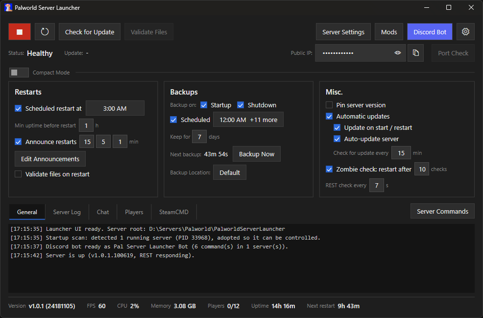
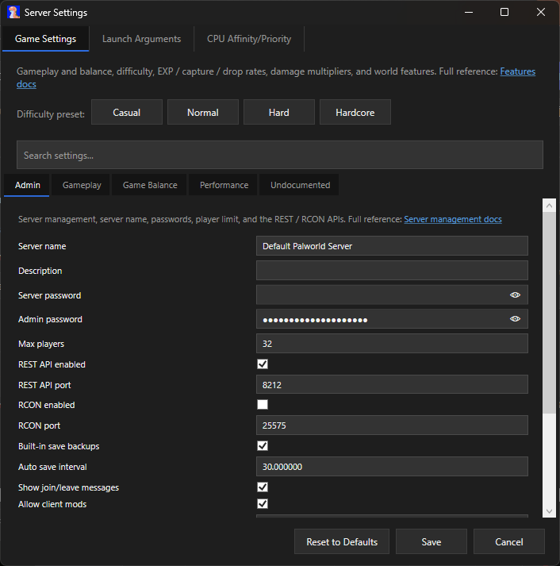
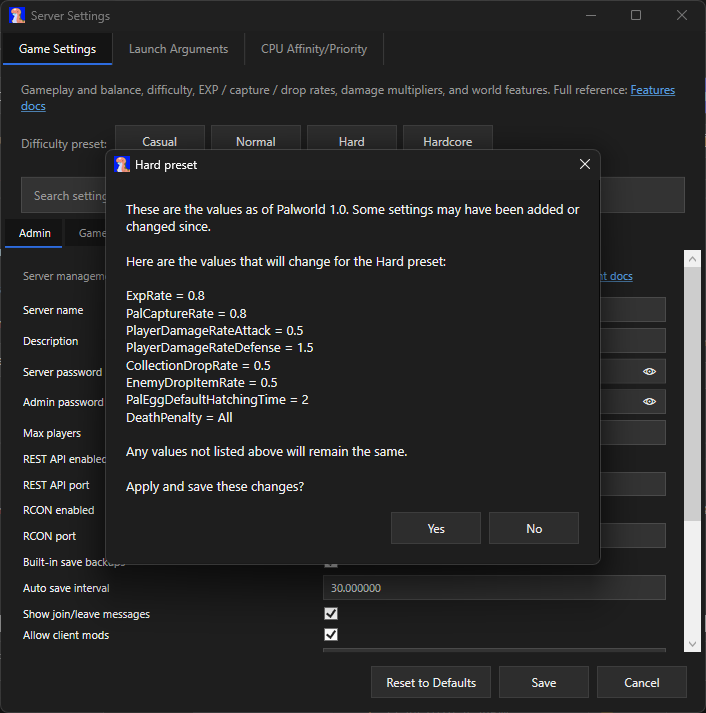
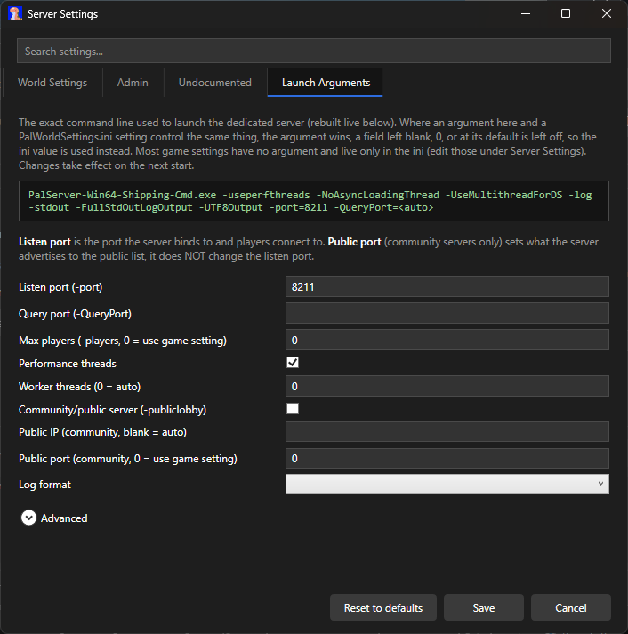
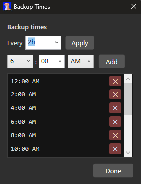
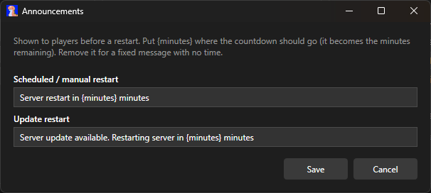

# Palworld Server Launcher

[](https://github.com/SSyl/PalworldServerLauncher/releases/latest) [](LICENSE)

A Windows app for running a **Palworld dedicated server**: installs it, keeps it updated, handles scheduled
restarts and backups, and watches its health, all through Palworld's REST API. Native C# / WPF, single `.exe`.
Inspired by [Conan Exiles' Dedicated Server Launcher](https://forums.funcom.com/t/introducing-the-conan-exiles-dedicated-server-app/21699).

> [!NOTE]
> **Status:** pre-release and still a work in progress.



---

## Contents

- [Features](#features)
- [Screenshots](#screenshots)
- [Getting started](#getting-started)
- [File locations](#file-locations)
- [Running more than one server](#running-more-than-one-server)
- [Command-line options](#command-line-options)
- [Upcoming features](#upcoming-features)
- [Building from source](#building-from-source)
- [Privacy and security](#privacy-and-security)

---

## Features

### Install and update
- Installs SteamCMD and the server for you. **Start** checks for an update first (can be turned off).
- **Auto-updates when a new build drops**, restarting gracefully to apply it. Version-agnostic, so it keeps
  working across game updates without needing to be told about them.
- **Check for Update** (safe while running) and **Validate Files** buttons.

### Restarts and recovery
- **Scheduled restarts** at the times you set, with a minimum-uptime guard so a server that just came up
  won't get bounced.
- **In-game warnings** before a restart, at whatever marks you choose, skipped when nobody's online.
- **Crash and zombie recovery.** Restarts automatically on a crash, and also catches a server that's
  technically running but wedged (REST stopped answering, or the world stopped advancing). A safety cutoff
  stops it from looping forever if the server keeps dying.

### Backups
- Zips the world save and config, timestamped. Runs on startup, shutdown, a schedule, or on demand.
- Triggers a fresh in-game save first when the REST API is on, so the backup is actually current. Old
  automatic backups age out after a set number of days, manual ones are left alone.

### Keeping an eye on things
- Live tiles for FPS, players, uptime, memory, version, and when the next restart and backup are due.
- Player joins and leaves show up in the log as they happen.
- **Port Check**: tests whether your game port is reachable from outside your network, and warns if your
  REST or RCON ports are exposed to the internet. Asks first, since it sends your public IP to an external
  checking service to run the test.

### Settings
- A full **Server Settings** editor for `PalWorldSettings.ini`, tabbed (World Settings / Admin /
  Undocumented), labeled with the game's own wording where it has one. Only writes what you changed, and
  shows a preview before saving.
- **Difficulty presets**: Casual, Normal, Hard, or Hardcore in one click, previewed first.
- A **Launch Arguments** editor with a live preview of the exact command line.
- **Advanced**: set the server's process priority and pin it to specific CPU cores, re-applied automatically
  since Unreal resets affinity on launch.

### Background and logs
- Runs the server quietly in the background, no console window. Survives the launcher closing or crashing,
  and picks the server back up next time you open it.
- Logs from the launcher, SteamCMD, and the server show up in-app and to a rotating log file (last ten kept).
  `--debug` and `--console` give more detail, see [Command-line options](#command-line-options).

### Discord (optional)
- **Webhook** notifications when the server comes up, goes down, updates, crashes, or players come and go.
- A **control bot**: `/status`, `/players`, `/save`, `/backup`, `/update`, `/start`, `/restart`, `/stop` from
  a locked-down channel and/or role. Restart and stop confirm first. Setup guide:
  [docs/discord-bot-setup.md](docs/discord-bot-setup.md).

---

## Screenshots

**The settings editor.** One tabbed window for every `PalWorldSettings.ini` value, labeled with the game's own wording.



**Difficulty presets.** Apply a Casual / Normal / Hard / Hardcore set of values, with a preview of exactly what changes.



**Launch arguments**, with a live preview of the exact command line.



**Picking restart and backup times.**



**Customizable in-game restart announcements.**



---

## Getting started

You'll need **Windows 10 or 11 (64-bit)**, and room and bandwidth for the server install (the first SteamCMD
download is a few GB).

> [!NOTE]
> The first time you run it, Windows may show a blue "Windows protected your PC" box, because the app isn't
> code-signed. Click **More info**, then **Run anyway**.

1. Run `PalworldServerLauncher.exe`.
2. Click **Install** to grab SteamCMD and the server. You only need this the first time.
3. Click **Start**. The very first launch creates the server's config files.

   > [!TIP]
   > Windows Firewall may ask whether to allow the Palworld server through. Click **Allow access**, otherwise
   > the server won't be reachable over the network and players won't be able to connect.
4. When offered, turn on the **REST API** (it can generate a secure admin password for you). It's what powers
   the stats, graceful restarts, backups, and health checks. Without it the server still runs, but the
   launcher has to hard-stop it instead of shutting it down cleanly.
5. Optional: turn on **Scheduled restart** and pick your times, set up **Backups**, and connect **Discord**.

## File locations

Everything the launcher manages, its own `launcher.json` settings, the server install, backups, and logs,
lives in a `PalworldServerLauncher` folder next to the exe. The game's own settings live in
`PalWorldSettings.ini`, editable from the launcher (Server Settings and Launch Arguments) or by hand.

## Running more than one server

Each copy of the exe runs one server, installed next to it. To run several on the same machine, drop a copy
of the exe into its own folder per server. Each one stays completely separate (settings, logs, install,
backups). Just give each server its own ports:

- **Listen port** (`-port`, default 8211), set under **Launch Arguments**.
- **REST API port** (default 8212) and **RCON port** (default 25575, if you turn it on), set in that
  server's `PalWorldSettings.ini`.

The Steam query port sorts itself out automatically by picking the first free one.

## Command-line options

You can double-click the launcher, or start it from a terminal with a couple of extra options:

- `--debug` (or `--verbose`): write more detailed logs.
- `--console`: mirror the launcher's logs into the terminal you started it from, handy for keeping an eye on
  a server from the command line.

```powershell
PalworldServerLauncher.exe --console --debug
```

## Upcoming features

- Mod support (Steam Workshop and maybe Nexusmods)
- A headless mode you can drive entirely from the command line (start, stop, status, no window).
- A system-tray icon and a copy-the-connection-info button.

## Building from source

> [!TIP]
> You don't need to do this as a regular user, grab a pre-built `.exe` from the
> [releases page](https://github.com/SSyl/PalworldServerLauncher/releases/latest) instead. This is only for
> building the app yourself, which requires the **.NET 10 SDK**.

From the repository root:

```powershell
dotnet build
dotnet test
dotnet run --project src\PalServerLauncher              # run it
dotnet publish src\PalServerLauncher -c Release         # build a single self-contained .exe
```

Pass launcher options after `--`, for example `dotnet run --project src\PalServerLauncher -- --console`.

## Privacy and security

> [!WARNING]
> Palworld's REST API and RCON aren't built to face the internet. Keep those ports (8212 and 25575) on your
> local network or behind a firewall, and only forward the game ports your players actually need.

The launcher runs on your machine and does not collect, transmit, or phone home any of your data. There is no
telemetry and no analytics. It makes network connections only to:

- your own server, over `127.0.0.1` (your local machine),
- Steam, to download SteamCMD and to install or update the server,
- your own Discord webhook and bot, if you choose to set them up,
- the **Port Check** feature, only if you use it, and only after it warns you first: it sends your public IP
  and the ports you're testing to check-host.cc, a free external probe service, and uses a separate lookup
  service to show your Public IP field.

Your settings, logs, backups, and any tokens stay on your PC in the launcher's folder, and your Discord bot
token is never written to the logs. Lock the control bot down to a private channel and/or an admin-only role.

---

*Not affiliated with or endorsed by Pocketpair. "Palworld" is a trademark of its respective owner.*
