# Palworld Server Launcher

  

A Windows app that runs a **Palworld dedicated server** for you. It installs the server, keeps it updated,
runs scheduled restarts and backups, and restarts it when it crashes or stops responding. Native C# / WPF in a
single `.exe`. Inspired by [Conan Exiles' Dedicated Server Launcher](https://forums.funcom.com/t/introducing-the-conan-exiles-dedicated-server-app/21699).

**[Download the latest release](https://github.com/SSyl/PalworldServerLauncher/releases/latest)**

Also available in German, Spanish, French, Brazilian Portuguese, Russian, Japanese, Simplified Chinese,
Traditional Chinese, and Korean. See [Languages](#languages).

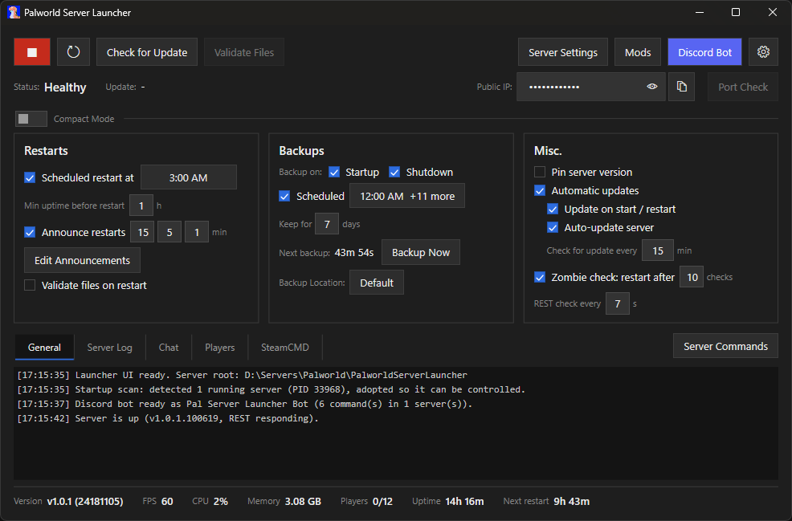

---

## Contents

- [Features](#features)
- [Getting started](#getting-started)
- [Screenshots](#screenshots)
- [FAQ and troubleshooting](#faq-and-troubleshooting)
- [Advanced usage](#advanced-usage)
- [Privacy and security](#privacy-and-security)

---

## Features

### Install and update
- Installs SteamCMD and the server for you. **Start** checks for an update first, and you can turn that off.
- Updates itself when a new build drops and restarts gracefully to apply it. No version to configure.
- Pin the server to its current build to hold updates back when a game update breaks something.
- **Check for Update** is safe to run while the server is up. **Validate Files** repairs a damaged install.
- **Import an existing server** from elsewhere. It gets copied in, and your original is left where it was.

### Restarts and recovery
- Scheduled restarts at times you set, with a minimum uptime so a server that just came up isn't bounced.
- In-game warnings before a restart, at the marks you choose, skipped when nobody is online.
- Restarts after a crash, and also catches a server that is running but no longer responding.
- A cutoff stops the restarts if the server keeps dying, so it can't loop.
- Crash lines report how long the server was up, the exit code, and the reason Palworld itself recorded.

### Backups
- Zips the world save and config, timestamped, on startup, shutdown, a schedule, or on demand.
- Saves the world in-game first when the REST API is on, so the backup is current rather than stale.
- Automatic backups age out after a set number of days. Manual ones are left alone.
- Keep them next to the launcher or in a folder of your choice.

### Monitoring
- Live tiles for FPS, players, uptime, memory, version, and the next restart and backup.
- Player joins and leaves appear in the log as they happen.
- **Port Check** tests whether your game port is reachable from outside, and warns if REST or RCON are exposed.

### Settings
- A tabbed editor for `PalWorldSettings.ini`, using the game's own wording for each setting where it has one.
- Search filters the settings as you type, by name, label, or description.
- Only the keys you changed get written, and you see them before saving.
- Difficulty presets for Casual, Normal, Hard, and Hardcore, previewed before they apply.
- A launch arguments editor showing the exact command line it will use.
- Set the server's process priority and pin it to CPU cores. Unreal resets affinity on launch, so it reapplies.

### Background and logs
- The server runs hidden, with no console window, and survives the launcher closing or crashing.
- Next time you open the launcher it offers to pick that server back up, or does it on its own if you prefer.
- **Start at login** opens the launcher and starts the server when you sign into Windows.
- Launcher, SteamCMD, and server logs appear in-app and in a rotating log file, keeping the last ten.
- `--debug` and `--console` add detail, see [Command-line options](docs/advanced-usage.md#command-line-options).

### Discord (optional)
- Webhook notifications when the server starts, stops, updates, or crashes, and when players join or leave.
- A control bot for `/status`, `/players`, `/save`, `/backup`, `/update`, `/start`, `/restart`, and `/stop`.
- The bot answers only in a channel and role you pick, and restart and stop ask for confirmation.
- Setup guide: [docs/discord-bot-setup.md](docs/discord-bot-setup.md).

### Languages
- Ten languages: English, Deutsch, Español, Français, Português (Brasil), Русский, 日本語, 简体中文, 繁體中文, 한국어.
- Pick one on first run, or later from Launcher Settings under the gear icon. It restarts to apply.
- Everything but English is machine-translated, so corrections via an issue or pull request are welcome.

---

## Getting started

You need **Windows 10 or 11 (64-bit)** and about 6 GB of disk space for the server as of Palworld 1.0. The
launcher uses around 100 MB of RAM, but the Palworld server it runs needs a lot more, so check Palworld's
[official requirements](https://docs.palworldgame.com/getting-started/requirements/) before you host.

**Download** the latest `PalworldServerLauncher.exe` from the
[releases page](https://github.com/SSyl/PalworldServerLauncher/releases/latest). It's a single file with no
installer, so drop it wherever you want the server to live.

> [!NOTE]
> The first time you run it, Windows may show a blue "Windows protected your PC" box, because the app isn't
> code-signed. Click **More info**, then **Run anyway**. Some antivirus tools flag it for the same reason. If
> that worries you, the full source is here and you can [build it yourself](#building-from-source).

1. Run `PalworldServerLauncher.exe`.
2. Click **Install** to grab SteamCMD and the server. You only need this the first time.
3. Click **Start**. The first launch creates the server's config files.

> [!TIP]
> Windows Firewall may ask whether to allow the Palworld server through. Click **Allow access**, or the
> server won't be reachable over the network and players won't be able to connect.

4. When offered, turn on the **REST API**, which can generate a secure admin password for you. It drives the
   stats, graceful restarts, backups, and health checks. Without it the server still runs, but the launcher
   has to force-stop it instead of shutting it down cleanly.
5. Optional: turn on **Scheduled restart** and pick your times, set up **Backups**, and connect **Discord**.

---

## Screenshots

|  |  |
| :-: | :-: |
| 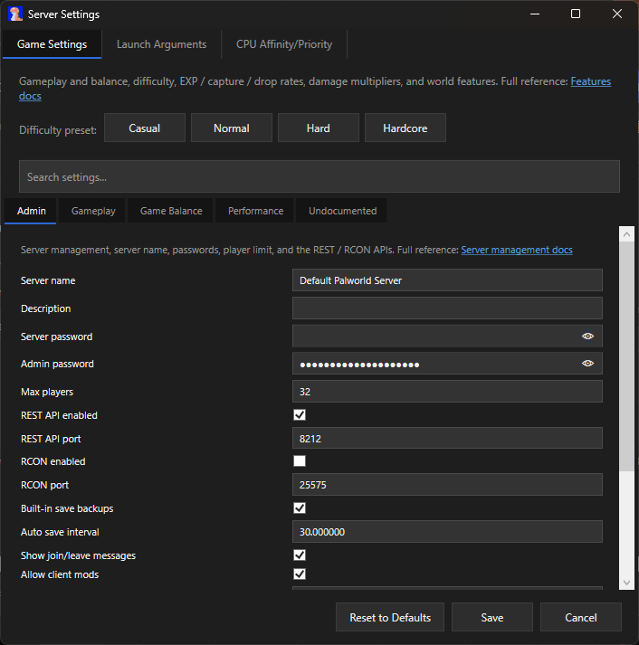 | 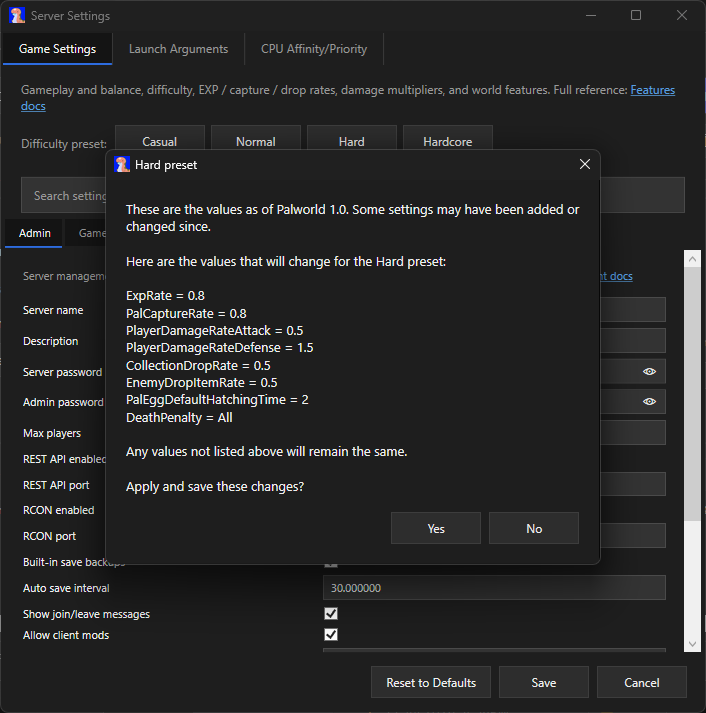 |
| 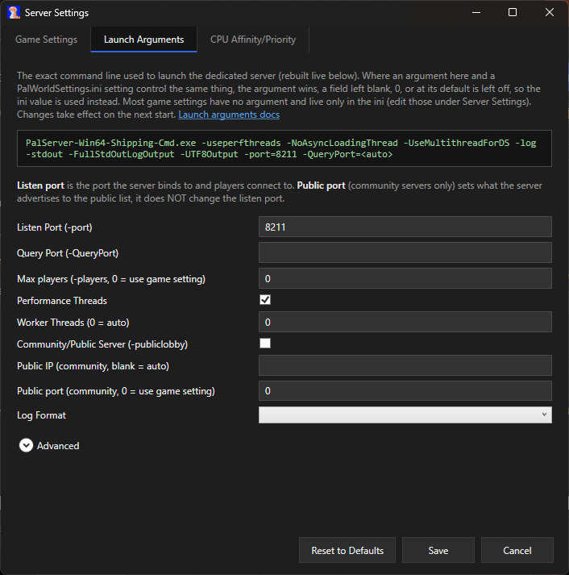 | 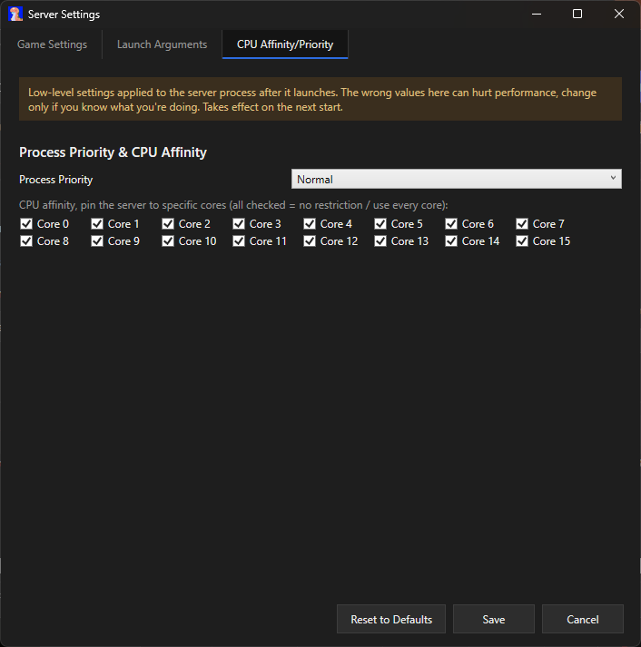 |
| 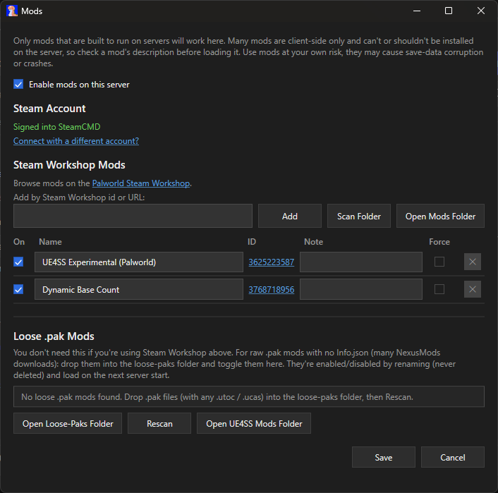 | 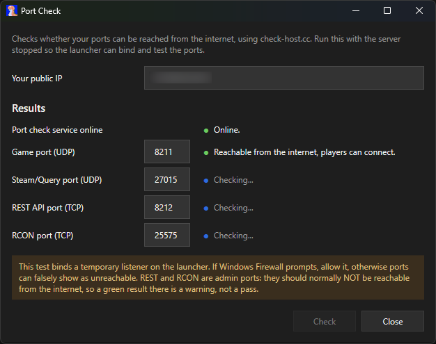 |
| 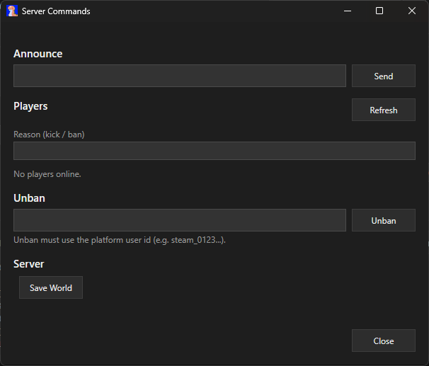 | 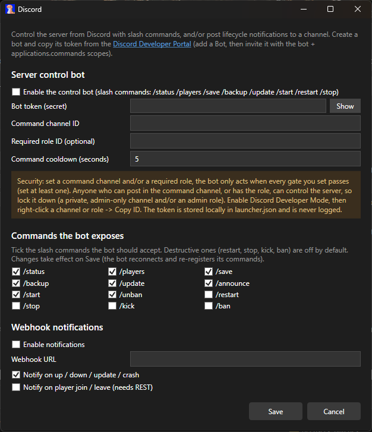 |
| 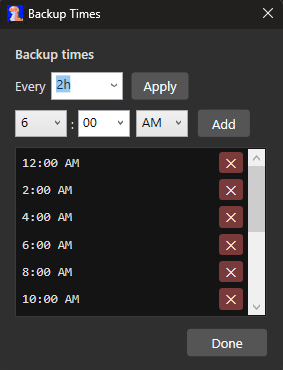 | 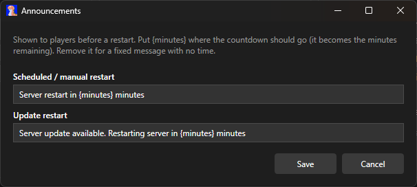 |

**Available in ten languages.** English, German, Spanish, French, Brazilian Portuguese, Russian, Japanese,
Simplified Chinese (shown here), Traditional Chinese, and Korean.

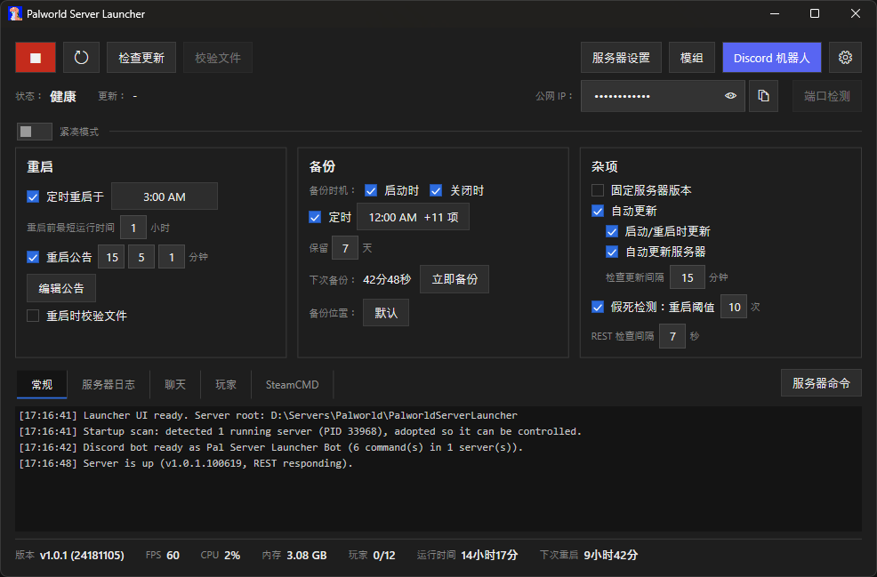

---

## FAQ and troubleshooting

**[docs/FAQ.md](docs/FAQ.md)** covers how you and your friends connect and why a connection fails (firewall,
port forwarding, CGNAT). It also has getting listed in the community server browser, updating and pinning
versions, importing a server you already have, modding, and where your files live.

## Advanced usage

**[docs/advanced-usage.md](docs/advanced-usage.md)** covers running more than one server on a machine, and the
command-line options (`--console`, `--start-server`, `--install-server`, `--stop-server`, and more).

## Upcoming features

- A system-tray icon.
- A fuller headless mode. `--install-server`, `--start-server`, and `--stop-server` already exist (see
  [Command-line options](docs/advanced-usage.md#command-line-options)), and a small PowerShell script can run
  the launcher hidden in the meantime.

## Building from source

Most people don't need this, just grab a pre-built `.exe` from the
[releases page](https://github.com/SSyl/PalworldServerLauncher/releases/latest). To build it yourself you'll
need the **.NET 10 SDK**, see **[docs/building.md](docs/building.md)**.

## Privacy and security

> [!WARNING]
> Palworld's REST API and RCON aren't built to face the internet. Keep those ports (8212 and 25575) on your
> local network or behind a firewall, and only forward the game ports your players actually need.

The launcher runs on your machine and has no telemetry or analytics. It makes network connections only to:

- your own server, over `127.0.0.1`,
- Steam, to download SteamCMD and to install or update the server,
- your own Discord webhook and bot, if you set them up,
- **Port Check**, if you use it, and it warns you before it runs. It sends your public IP and the ports being
  tested to check-host.cc, a free external probe service, and a separate lookup fills in your Public IP field.

Your settings, logs, backups, and tokens stay on your PC in the launcher's folder, and the Discord bot token
is never written to the logs. Lock the control bot down to a private channel and an admin-only role.

---

*Not affiliated with or endorsed by Pocketpair. "Palworld" is a trademark of its respective owner.*
