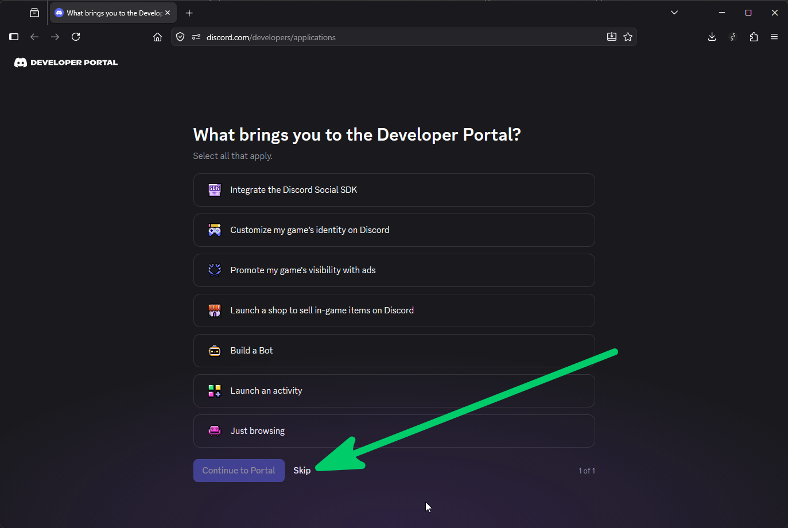
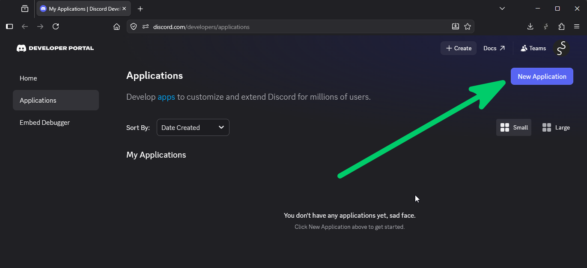
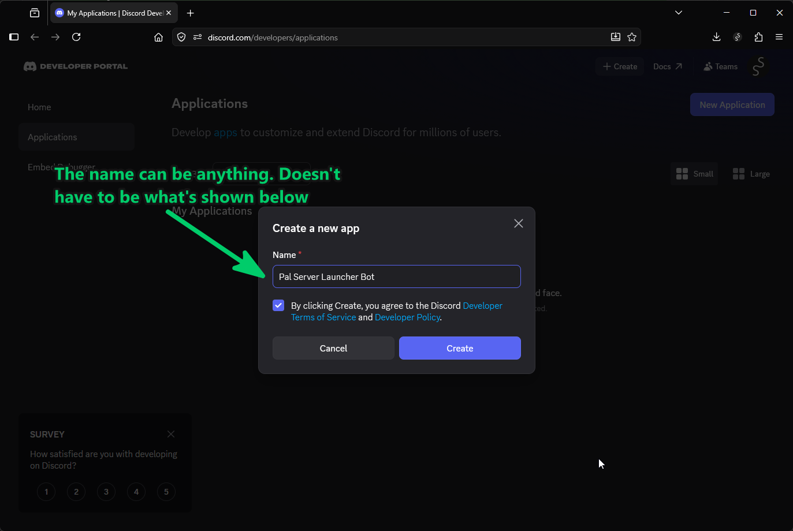
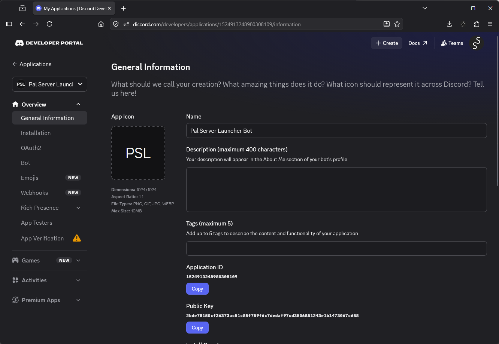
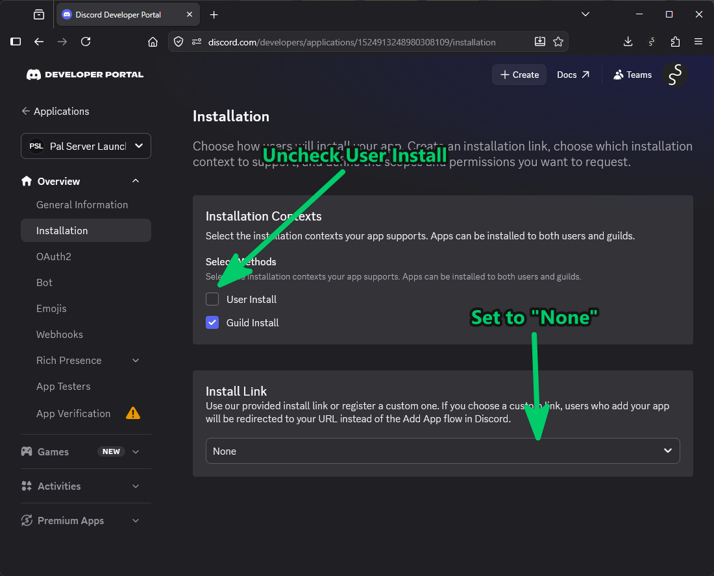
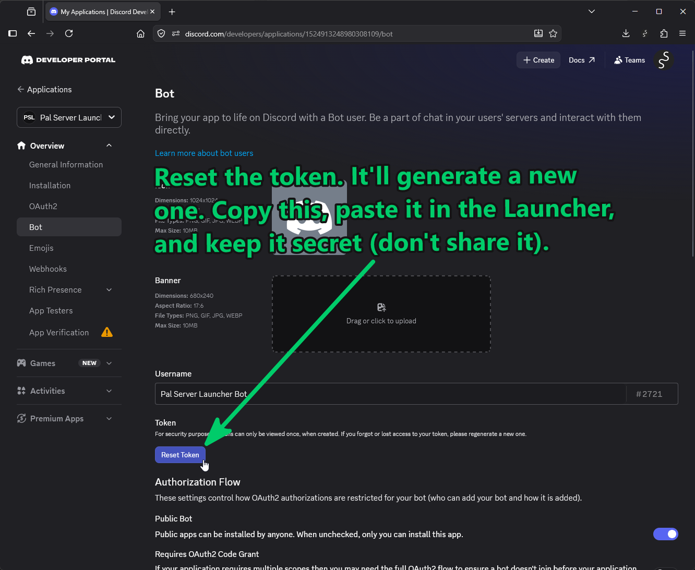
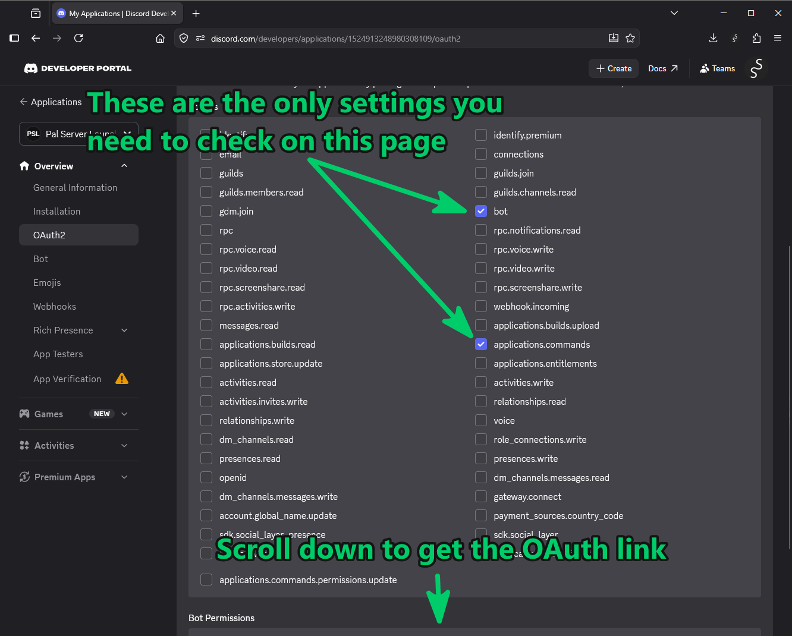
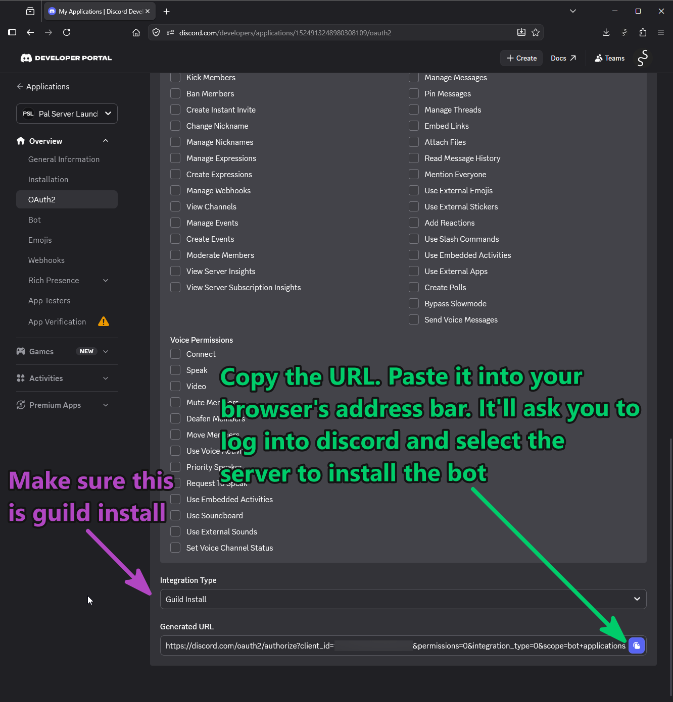
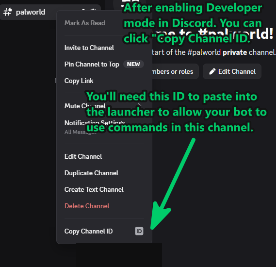
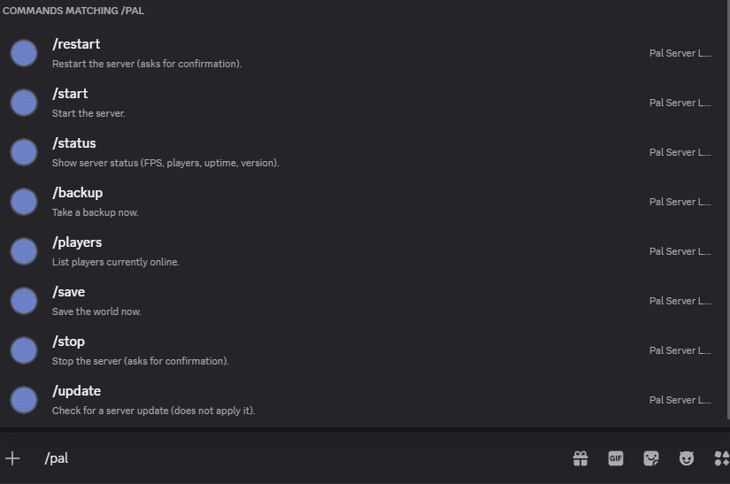

# Discord control bot: setup guide

This guide sets up a little Discord bot so you can control your server straight from Discord. Once it's done,
you (and anyone you trust) can type commands like `/status`, `/restart`, or `/backup` in a Discord channel,
and the launcher takes care of the rest.

It's a one-time setup and takes about 10 minutes. You don't need to be technical. Just follow the steps and
click along.

A couple of things to know first:

- The bot only works while the launcher is running on your PC. It reaches out to Discord on its own, so
  there's nothing to open or forward on your router.
- There's no shared bot. You're making your own, and it's yours alone.

---

## What you'll need
- A Discord account.
- A Discord server you own, or one where you're allowed to add bots.
- About 10 minutes.

## The one thing everyone gets wrong
When you make a bot, Discord shows you a few different long codes. Only one of them, the **bot token**, goes
into the launcher. As far as we're concerned, the other two are decoys.

| Code | Where you'll see it | Do you use it? |
|---|---|---|
| **Application ID** | General Information page | No |
| **Public Key** | General Information page | No |
| **Bot token** | **Bot** tab | ✅ Yes, this is the one |

> [!IMPORTANT]
> **Only the bot token works.** If you paste the Application ID or Public Key into the launcher, the bot
> won't connect.

---

## 1. Make the application

Open the [Discord Developer Portal](https://discord.com/developers/applications). This is just Discord's
website for making bots. If it's your first visit, you might get a **"What brings you to the Developer
Portal?"** pop-up. You can ignore it. Just click **Skip** in the bottom left.

Click **New Application** in the top right.

Type a name (anything works, for example "Pal Server Launcher Bot"), tick the box to agree to the terms, and
click **Create**.

Now you're on the **General Information** page. It shows an Application ID and a Public Key. You don't need
either of those, so just move on.

## 2. Turn off the install link

On the left, click **Installation**.

1. Find **Installation Contexts** and untick **User Install**. Leave **Guild Install** ticked.
2. Find **Install Link** and change its dropdown to **None**.

> [!IMPORTANT]
> **Why do this now?** In step 4 you'll turn off "Public Bot". If you haven't done this step first,
> Discord shows an error that says *"Private application cannot have a default authorization link."* Setting
> Install Link to **None** now avoids that headache. It doesn't stop you from adding the bot to your server,
> because you'll make your own invite link in step 5.

## 3. Copy your bot token

On the left, click **Bot**.

1. Under **Token**, click **Reset Token** (Discord hides it until you do this), and confirm.
2. Click **Copy**.

That copies your bot token. Paste it somewhere safe for now, like an empty notepad, because you'll need it in
step 8.

> [!WARNING]
> **Treat the token like a password.** Anyone who has it can control your bot. Discord only shows it once,
> and that's fine. If you ever lose it, just click Reset Token again to get a new one. The launcher keeps it
> on your PC in a file called `launcher.json` and never puts it in any log.

## 4. Lock the bot down

Stay on the **Bot** page and set three things:

- Turn **Public Bot** **off**, so nobody else can add your bot.
- Turn **Requires OAuth2 Code Grant** **off** (leaving it on breaks the easy invite).
- Under **Privileged Gateway Intents**, turn **all three** off (Presence, Server Members, Message Content).
  Your bot doesn't need them, and turning them off means it can't read your normal chat messages.

## 5. Make the invite link

On the left, click **OAuth2**, then find the **OAuth2 URL Generator** section.

Under **Scopes**, tick these two boxes and nothing else:

- **`bot`**
- **`applications.commands`**

That second one is what makes the slash commands (`/status` and friends) appear, so don't forget it.

Now scroll down a bit:

- **Bot Permissions:** you can leave everything unticked, since the bot's replies are private. If you want,
  you can tick **View Channels** and **Send Messages**, but it isn't required.
- **Integration type:** make sure it says **Guild Install**. This adds the bot to your server, not to a
  single person.
- At the very bottom, copy the **Generated URL**.

## 6. Add the bot to your server

That URL you just copied is an **invite link**. It does not go into the launcher. Instead, paste it into your
web browser's address bar and press Enter. Discord will ask you to:

1. Choose **your server** from the dropdown.
2. Click **Authorize** (and solve the captcha if it shows one).

Your bot is now in your server. It'll look **offline** for now, which is completely normal. It comes online
once the launcher connects to it later.

## 7. Get your channel and/or role ID

The launcher will only let the bot take commands from a **channel** you pick, and/or from people who have a
**role** you pick. You need at least one of these.

First, switch on a setting that lets you copy IDs. In Discord, go to **User Settings**, then **Advanced**,
and turn on **Developer Mode**.

- **Channel:** make a **private channel** that only your admins can see, then right-click it and choose
  **Copy Channel ID**.
- **Role (optional):** go to **Server Settings**, then **Roles**, right-click the role you want, and choose
  **Copy Role ID**.

> [!WARNING]
> **Keep it private.** Anyone who can type in that channel, or who has that role, can control your server.
> Use a private, admins-only channel and/or an admin role.

## 8. Put it all into the launcher

Back in the launcher, click the **Discord** button (in the Misc box):

1. Tick **Enable the control bot**.
2. Paste your **bot token** from step 3 (not the Application ID or Public Key).
3. Paste the **Command channel ID** and/or the **Required role ID** (at least one).
4. Click **Save**.

The moment you save, the launcher connects and adds the commands to your server. It's instant.

## 9. Try it out

Go to your command channel and type `/`. You should see `/status`, `/players`, and the rest pop up.

Try **`/status`**. For `restart` and `stop`, the bot asks you to click a **Confirm** button first, just so
you don't bounce the server by accident. There's also a short wait between commands so nobody can spam them.

That's it. You're done.

---

## If something isn't working

- **The commands don't show up when I type `/`.** The invite probably missed the **`applications.commands`**
  box. Go back and redo steps 5 and 6 with both boxes ticked, then authorize again.
- **The bot stays offline.** Check that the launcher is running and that you ticked **Enable the control
  bot**. If it still won't connect, double-check the token, and look in the launcher's General log tab for a
  line that says "Discord bot failed to connect".
- **It says "You're not allowed to run commands here."** You're either in the wrong channel, or you don't
  have the required role. Make sure the channel ID and role ID in the launcher match the right ones (turn on
  Developer Mode, then use Copy ID).
- **Nothing happens, and I didn't set a channel or role.** On purpose, the bot ignores everything until you
  give it at least one of those. Set a command channel and/or a required role.
- **It says REST is off.** Commands like `/status` and `/save` need the server's REST API turned on. The
  launcher offers to set that up for you the first time, or see the main README.

## Good to know
- Discord has its own way to control who can use each command too (open Server Settings, then Integrations,
  then your bot). That's completely optional, and it works on top of the channel and role you set in the
  launcher.
- Your token, channel ID, and role ID are saved in `launcher.json`, alongside the launcher. Keep that file
  to yourself.
